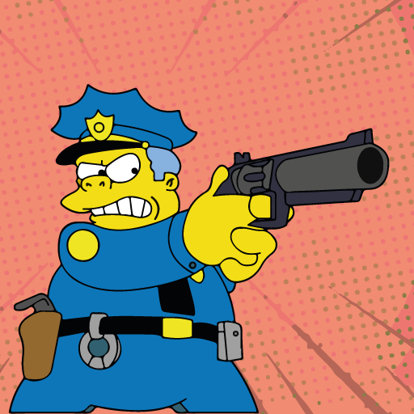

# stereo-polizei
Correlation Meter / Meme for the Sinee Community

## What it does

It's a correlation meter, which displays values from -1 to 1.
It also has the Simpson's Chief Wiggum reacting to you audio input.

| Good Cop      | Bad Cop         |
| ------------- |:-------------:|
|      |  |

## VST2

Since it's 2021, I cannot provide a VST2 build. If you happen to have a license yourself, you can build it using the [JUCE](https://juce.com/) framework.

## VST3

You can find a VST3 build [on the releases pages](https://github.com/barthy-koeln/stereo-polizei/releases).